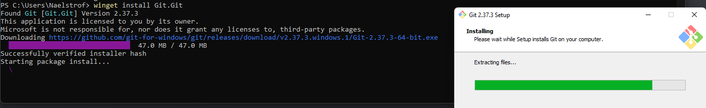

# Contributing

If you want to contribute to KoboldKare, first you'll want to make an issue describing the thing you want to change.
A moderator should respond to help collaborate and contribute to making the change happen.

After that, in order to contribute to KoboldKare, you just need to do the following:
- Fork the project.
- Make the change.
- Submit a pull request.

You can read more about how this is done here: https://docs.github.com/en/get-started/quickstart/fork-a-repo

# Installing and Editing KoboldKare

1. Install git. If you're on modern windows, you can use the `winget` package manager for this:
   
   Just install it by typing `winget install Git.Git` into a powershell or cmd.
2. Install blender. Funnily enough this is *also* in the windows package manager. You can install it with `winget install BlenderFoundation.Blender`.
3. Install UnityHub, winget has this available as: `winget install Unity.UnityHub`
4. Download the KoboldKare's version of Unity. As of this commit it is 2021.3.19f1, which you can download by putting this link into a browser: [unityhub://2021.3.19f1/c9714fde33b6](unityhub://2021.3.19f1/c9714fde33b6)
5. Restart the computer. This is important if you've just installed git. As you need to make sure the git executable is in your path **before** you try to open the project.
6. Clone the KoboldKare repository. This can be done with something like Github Desktop. You'll want to clone *your* fork of KoboldKare, so that you'll have access to push commits.
7. Open the KoboldKare folder with UnityHub. It should now import correctly!

This is all you need to do to open, edit, and test KoboldKare.

# Building

You do not need to build KoboldKare to make changes, though to prevent questions-- here's how to build KoboldKare when you get to it.
You first need to build addressables.
You can find instructions on that here: https://docs.unity3d.com/Packages/com.unity.addressables@1.20/manual/Builds.html

After that you can build normally (File->Build Settings->Build).